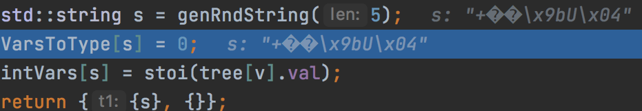

# MAFFIN


For looking at the structure beneath:
 `@debug`

For changing float numbers' precision:
`@precision x`, where `x` is precision

If you need to print something:
`print( "something" )`

To compile text
`~`

## TODO

1) fix bug
```asm
stack a;
push(a, 5);
push(a, 6);
push(a, 10);
print(get(a, 0));
print(get(a, 1));
print(get(a, 2));
set(a, 0, 2);
print(get(a, 0));
pop(a);
push(a, 100);
print(get(a, 2));
~
```

RETURNS

```c
0 
0 
10 
0 
100 
```

## EXAMPLES

### V 0.85 (`for` renamed to `while`, bugs with `while` fixed)

###### №1

```asm
    int i = 0;
    while (i < 4){
        print(i);
        int u = 1;
        i = i+u;
    }
    ~
```

RETURNS

```c
    0
    1
    2
    3
```

### V 0.8 (`for` loop with one argument) // it was extremely easy because everything for loop I already had

###### №1

```asm
    int a = 0;
    for (a < 3){
        a = a+1;
        print(a);
    }
    ~
```

RETURNS

```c
    1
    2
    3
    4
```

### V 0.7 (recursion)

###### №1

```asm
    func loop{
        if (get(Args, 0) == 6) { return 0; }
        int i = get(Args, 0);
        print(i);
        print(sizeof(Args));
        print();
        loop(i+1);
        return 0;
    }
    loop(0);
    ~
```

RETURNS

```c
    0
    1
    
    1
    1
    
    2
    1
    
    3
    1
    
    4
    1
    
    5
    1 
```

###### №2

```asm
    func loop{
        print(get(Args, 0));
        if (get(Args, 0) == get(Args, 1)) { return 0; }
        loop(get(Args, 0)+1, get(Args, 1));
        return 0;
    }
    loop(0, 6);
    ~
```

RETURNS

```c
    0 
    1 
    2 
    3 
    4 
    5 
    6
```

### V 0.65 (`&&`, `||` operations)

###### №1

```asm
    if ((3 > 2) || (3 < 2)){
        print(228);
    }
    if ((3 > 2) && (3 < 2)){
        print(822);
    }
    ~
```

RETURNS

```c
    228
```

### V 0.6 (`if` statements implemented)

###### №1

```asm
    if (3 > 2)
    {
        print(3);
    }
    ~
```

RETURNS

```c
    3
```

###### №2

```asm
    if (3 < 2)
    {
        print(100);
    }
    if (3 > 2)
    {
        print(50);
    }
    ~
```

RETURNS

```c
    50
```

### V 0.5 (`bool` types and operations with them implemented)

###### №1

```asm
    print(3 < 2);
    print(3 <= 2);
    print(3 > 2);
    print(3 >= 2);
    print(3 == 2);
    print(2 < 2);
    print(2 <= 2);
    print(2 > 2);
    print(2 >= 2);
    print(2 == 2);
    ~
```

RETURNS

```c
    0
    0
    1
    1
    0
    0
    1
    0
    1
    1 
```

###### №2

```asm
    int a = 35;
    int b = a+100;
    print(b < a);
    print(b > a);
    ~
```

RETURNS

```c
    0
    1
```

### V 0.45 (function arguments now in the array system)

It's little bit complicated thing, the point is that all the arguments
of the function are represented as an `Args` array, so when you are passing
any argument, to access them type `get(Args, 'index' )`, where `'index'`
is an `int` value. **_(V3 and V3.5 are permanently changed)_**

###### №1

```asm
    func lol{
        return get(Args, 0)+5;
    }
    print(lol(9));
    ~
```

RETURNS

```c
    14
```

###### №2

```asm
    int glob = 10;

    func f
    {
        int u = get(Args, 0);
        int v = get(Args, 1);
        glob = glob + u + v;
        return 0;
    }

    print(f(5, 9));
    print(glob);
    ~
```

RETURNS

```c
    0
    24
```

###### №3 FUN FACT

Here is no function with name `lol`, so it's just generating a container
of variables.

```asm
    print(lol(5, 9));
    print(5, 9);
    print((5, 9));
    ~
```

RETURNS

```c
    0 5 9
    5 9
    5 9
```

### V 0.4 (arrays implemented)

###### №1

```asm
    array a[30];
    set(a, 100, 3);
    int lol = get(a, 3);
    print(lol);
    ~
```

RETURNS

```c
    100
```

### V 0.35 (recursion added)

```asm
    func rec{
        a = a + 1;
        rec(a);
        return a;
    }
    
    int a = 3;
    rec(a);
    ~
```

RETURNS

nothing because infinite recursion

### V 0.3 (function implemented)

###### №1

```asm
    func lol {
        return 32+2;
    }
    
    print(lol());
    ~
```

RETURNS

```c
    34
```

###### №2

```asm
    func lol {
        a = a + 3;
        return a;
    }
    
    int a = 2;
    lol(a);
    print(a);
    a = lol(a);
    print(a);
    ~
```

RETURNS

```c
    2
    5
```

###### №3

```asm
    int kek = 100;
    
    func lol {
        kek = kek + 1;
        a = a + 1;
        return 5;
    }
    
    int a = 3;
    print(lol(a));
    print(kek);
    print(a);
    ~
```

RETURNS

```c
    5
    101
    3
```
As you can see, `a` variable hasn't changed because it was not in global scope,
to apply to `a` all alterations it should be coded `a = lol(a);`

###### №4

```asm
    int a = print(3);
    print(a);
    ~
```

RETURNS

```c
    3
    3
```

### V 0.2 (float implemented and `@debug` changed)

###### №1

```asm
    @debug
    @precision 30
    
    float a = 32.3423;
    print(a);
    ~
```

RETURNS

```c
    a(3) 13(2) 32.3423(3) =(2) (1) 
    print(2) a(3) ((2) (1) 
    (0) 
    32.3423000000000016029844118748 
```

### V 0.1

###### №1

```asm
    @debug

    int ok = 3;
    int op = 2;
    print(ok+op);
    
    ~
```

RETURNS

```c
    ok 0 3 =  
    op 0 2 =  
    print ok op + (  
     
    5 
```

###### №2

```asm
    @debug

    int lol = 2+3-4;
    print(lol-3);
    ~
```

RETURNS

```c
    lol 0 2 3 + 4 - =  
    print lol 3 - (  
 
    -2 
```

### FUNNY THINGS

